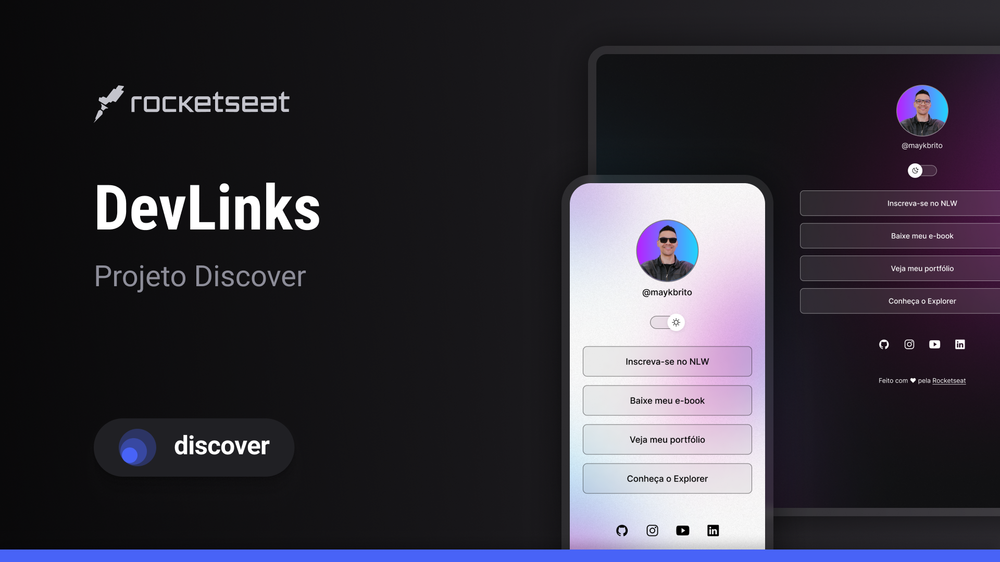

<h1 align="center">DevLinks</h1>

Criando um projeto seguindo o curso Discover da Rocketseat.

  <a href="#-tecnologias">Tecnologias</a>&nbsp;&nbsp;&nbsp;|&nbsp;&nbsp;&nbsp;
  <a href="#-projeto">Projeto</a>&nbsp;&nbsp;&nbsp;|&nbsp;&nbsp;&nbsp;
  <a href="#-layout">Layout</a>&nbsp;&nbsp;&nbsp;|&nbsp;&nbsp;&nbsp;
  <a href="#-memo-licenca">Licença</a>&nbsp;&nbsp;&nbsp;|&nbsp;&nbsp;&nbsp;

  

## 🚀 Tecnologias

Esse projeto foi desenvolvido com as seguintes tecnologias:

- HTML e CSS
- JavaScript

## 💻 Projeto

Projeto básico onde é possível alternar o modo para escuro e claro e possui alguns botões e ícones que redirecionam para páginas na web.

## 📔 Layout

Você pode visualizar o layout do projeto através [DESSE LINK](<https://www.figma.com/design/t8k6ngM0t9qL5uMgjI6hT5/DevLinks-%E2%80%A2-Projeto-Discover-(Community)?node-id=1437-191&t=PrSJOxQnNxDSmGUY-0>)

## 📝 Licença

Esse projeto está sob a licença MIT.

---

Feito com ❤️ by Rocketseat
